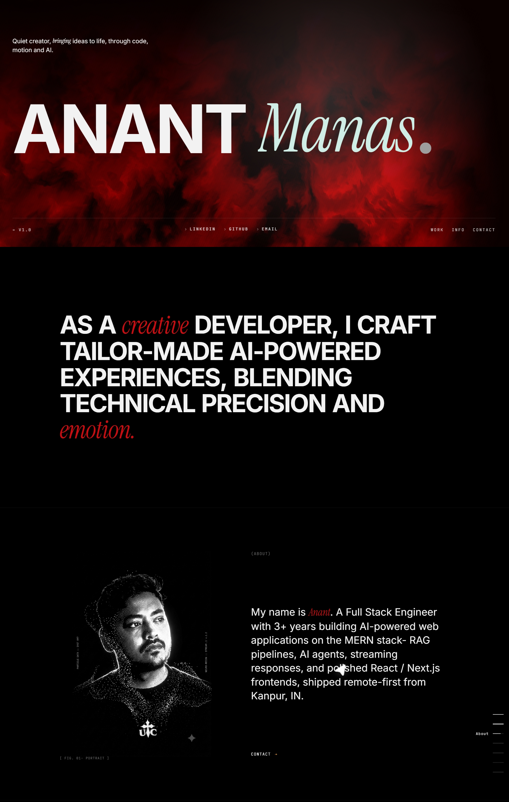

# Anant Manas — Portfolio

Personal portfolio project, I'm a creative full-stack developer. The site pairs a custom WebGL hero, scroll-driven editorial layout, and an interactive shell (custom cursor, dynamic island, theme toggle) over a TanStack Start + React 19 + Tailwind v4 stack.

🌐 **Live:** [https://anant-portfolio-2026.vercel.app/](https://anant-portfolio-2026.vercel.app/)

---



## Stack

| Layer          | Tool                                                                  | Notes                                                                                                                                           |
| -------------- | --------------------------------------------------------------------- | ----------------------------------------------------------------------------------------------------------------------------------------------- |
| Framework      | **TanStack Start** + **TanStack Router**                              | File-based routing, SSR via Nitro, type-safe params                                                                                             |
| UI runtime     | **React 19**                                                          | Server components, `useRouterState`, `Outlet`                                                                                                   |
| Build / dev    | **Vite 8** + **Nitro 3**                                              | Edge-ready worker output                                                                                                                        |
| Styling        | **Tailwind CSS v4** (CSS-first) + `tailwind-merge` + `clsx`           | `@custom-variant dark` for theme tokens, no JS config                                                                                           |
| Animation      | **Framer Motion** + **GSAP** + **Lenis**                              | FM for the cursor, dynamic island, view transitions · GSAP + ScrollTrigger for the manifesto / awards reveal · Lenis for smooth wheel scrolling |
| State / data   | **TanStack Query v5**                                                 | Query client wired in `__root.tsx`                                                                                                              |
| Schema / forms | **Zod** + **react-hook-form**                                         | Available for future form additions                                                                                                             |
| Icons          | **lucide-react**                                                      | Sun/Moon in the theme toggle                                                                                                                    |
| Components     | **shadcn/ui (Radix primitives)**                                      | Local to `src/components/ui/*` — button, dialog, sheet, calendar, etc.                                                                          |
| Custom shell   | **Lightswind UI** — `smooth-cursor`, `dynamic-island`, `toggle-theme` | The site's bespoke interactive layer                                                                                                            |
| Fonts          | **Inter**, **Instrument Serif**, **JetBrains Mono**                   | Loaded via Google Fonts in `__root.tsx`                                                                                                         |

---

## Design architecture

The site is deliberately dark-first editorial, with a light mode that is a first-class peer (not a placeholder). Three layers of intent:

**1. The hero — WebGL as a real surface, not a backdrop.**
A custom `WebGLLiquid` shader (in `src/components/WebGLLiquid.tsx`) is rendered as a full-bleed background in the hero. It's a heat-distorted fluid with three hardcoded color stops (deep → mid → highlight) and a configurable flow / grain. The whole hero sits behind a relative-z-10 content layer that holds the type system. The shader is theme-aware only by contrast — the deep colors read correctly against either mode.

**2. The scroll narrative — sections as chapters.**
The index page is built as eight scroll chapters (`#top`, `#manifesto`, `#info`, `#work`, `#skills`, `#awards`, `#experience`, `#contact`). Each is a separately-animated block:

- The hero uses the `SplitLetters` / `SplitWords` GSAP reveal.
- The manifesto text is opacity-driven by `ScrollTrigger.scrub` — every word fades in as it passes the 70% viewport line.
- The projects grid animates in tile-by-tile on scroll, with a per-tile custom cursor-follow preview (currently a `<div>` translated to the mouse with a 0.15 lerp) — implemented with vanilla `requestAnimationFrame`, not GSAP, so the trailing preview stays smooth even when GSAP is busy with ScrollTrigger.

**3. The interactive shell — global, but never blocking.**
Three Lightswind components live in the root shell:

- `SmoothCursor` — a framer-motion `useSpring` pointer that follows with damping, rotates by velocity, scales on click, and emits a 5-dot trail. It watches `<html>`'s `class` for `.dark` and inverts its color (white in dark, charcoal in light) in real time. It is suppressed on coarse-pointer devices and viewports below 768px (`hover: none` media query + `resize` listener).
- `DynamicIsland` — a fixed-position pill that surfaces scroll progress, the active section name, a font picker, a color-theme picker, and the theme toggle. The theme picker writes `--island-color` / `--island-color-2` to `<html>` for downstream CSS hookups; the toggle is a separate system that flips the `dark` class. Both persist to `localStorage`.
- `ToggleTheme` — uses the browser View Transitions API with a 12-variant animation set (default `diag-down-right`).

**4. Theme system — token-driven, not class-stripped.**
`styles.css` defines two token sets: `:root` (cool gray / charcoal light) and `.dark` (existing dark palette). The accent is shared across both. The grain overlay's `mix-blend-mode` switches from `overlay` (dark) to `multiply` (light) so the noise texture reads correctly on either ground. An inline script in `__root.tsx` reads `localStorage.theme` before hydration to prevent a flash of wrong theme.

---

## Project structure

```
src/
  components/
    ui/                  # shadcn primitives + Lightswind components
    lightswind/          # toggle-theme (manual install)
    WebGLLiquid.tsx      # hero shader
    GrainOverlay.tsx     # canvas grain texture
  hooks/
    use-mobile.tsx
  lib/
    utils.ts             # cn() helper
    projects.ts          # project data
  routes/
    __root.tsx           # global shell — mounts cursor, island, grain
    index.tsx            # the portfolio home
    work.tsx             # the projects deep-dive
  styles.css             # tokens, dark/light themes, utilities
```

## Deployment

The Nitro output is configured for Cloudflare Workers. Push to `main` and Vercel picks up the build, or run `npx nitro deploy --prebuilt` against the prebuilt `.output/`.

**Live site:** [https://anant-portfolio-2026.vercel.app/](https://anant-portfolio-2026.vercel.app/)
